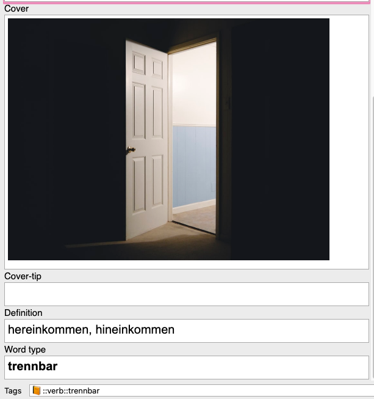

# German Vocabulary Cards

Introduction to the template

## Study & Usage

When you create a card, this will automatically create two cards:

- **German to Native language card**
- **Native language to German card**

### DE > EN

The front card only shows the word we created in German. The background is the picture we uploaded but blurred so it doesn't spoil the meaning while keeping differentiation among all cards.

The back card shows us the picture related to the word. If we hover over it or tap on it (mobile) it shows us the hint or mnemotechnique rule we assigned that word to better remember it:

The next area is the word area. Here we find the word in german, some examples that use that word and a tag that identifies the type of word. This is very useful when trying to differentiate between trennbar and untrennbar verbs:

Bellow the examples we find an arrow. If we click on it, it will drop down a menu where we can see extra information about the word. This could include fixed expressions using that word, the plural if the word was a noun, etc.:

Finally we have the area of translation and meaning. In this area we find the translation of the word and an optional definition that could be in German, to practice more!

---

## EN > DE

The front card shows us the picture, the translation of the word and an example where the word is missing. This is specially interesting because we are not only trying to recall the German word but also conjugate (plural/singular)? it within a sentence.

The back card looks exactly the same as the back card for DE > EN except that the keyword in the example is styled differently. 

---

### Input

This template has 9 inputs:

1. **front:** the word we want to memorize
2. **front+:** the word + sth extra. For example, if we are learning a noun, we would write "Mann" in front but "Mann, der" in front+, so that we are not only have to guess the meaning but also the gender!
3. **translation**
4. **example**
5. **extra**
6. **cover (picture)**
7. **cover-tip (hint)**
8. **definition**
9. **word type** (trennbar, untrennbar, ...)

In this example we only fill out "Front" since this verb doesn't have extra info. But let's have a look at other examples where this might be different:

In this example, becase it is a noun, we want Anki to ask us about "Aufstand" so that we can guess both its meaning but also its gender:

> Note how it doesn't ask for "der Aufstand" --> we have to guess the gender!

> on the back card it is always shown Front+ but if the field were empty because we didn't need it, it would then show Front.

In this example we have a translation and an example. ⚠️ **Important**: if you want the words in the example to be hidden when asked about the German word you have to make them bold like in the example. This would give us:

> Note how in this example we don't have any extra information. Let's have a look at an example where we do have extra info.

> Here we can see the style of extra information
>
> 

Finally we have the fields for the image, cover-tip, definition and word type:

Note how we can just copy past a screenshot on the field and it will show. 

⚠️ **Important**: When writing the word type it is important to make them bold so they are styled the way that they are presented here. Also the spaces between tags must not be bold, otherwise, two tags that are sepparate would appear to be connected, both formmated with the black background.

> If you write this:
> 
>
> without making the space between the two words not bold, you will get:
>
> 
>
> The way to fix this is to simply "unbold" the space between words:
>
> 

---

And this is how it works! If you want to see a working visualization of the cards from the browser you can check it out [here](). If you want to download the template you can do so from here [Download]().

Bare in mind I'm still working on improvements, and code cleaning. If you have any suggestion, you encounter a bug or you liked it and would like me to design a card template for you, let me know!